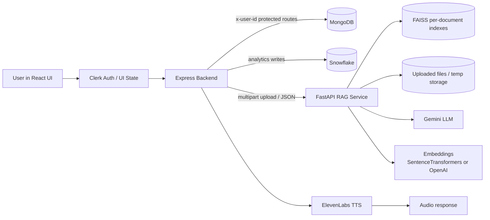

# LiveLegal AI

LiveLegal AI is a multi-service legal document intelligence platform built to ingest legal files, analyze them with a RAG pipeline, answer grounded questions, and generate voice responses for the same document context.

The project is split into three cooperating parts:

- `frontend/` - React/Vite user interface with Clerk auth, document workflows, chat, history, settings, and voice controls
- `backend/` - Node.js/Express API that handles auth, persistence, uploads, history, voice, and proxying to the RAG service
- `rag_service/` - Python FastAPI microservice that performs ingestion, chunking, embeddings, retrieval, and LLM-driven legal analysis

## What The System Does

The platform is designed around one central idea: a user uploads a legal document, the system turns that file into a searchable vector index, and then every analysis or chat response is grounded in the retrieved document chunks rather than generic model output.

Core user capabilities:

- Upload PDF or DOCX legal documents
- Ingest the document into a per-document FAISS index
- Ask questions about a specific document
- Generate plain-English legal summaries and explanations
- Produce a suggested reply / response draft
- Compute a severity or risk signal for the document
- Save chat and analysis history per user
- Convert answers to speech with ElevenLabs
- Show document history and document metadata in the UI

## High-Level Architecture



## Tech Stack

### Frontend

- React 18
- Vite
- React Router
- Clerk React for authentication UI and session handling
- Tailwind CSS + PostCSS + Autoprefixer
- Framer Motion for motion/animation
- Axios for API calls
- Lucide React for icons
- html2canvas for capture/export style interactions
- Three.js, `@react-three/fiber`, `@react-three/drei` for 3D visuals

### Backend

- Node.js
- Express.js
- Helmet for security headers
- CORS
- Morgan for request logging
- Multer for file uploads
- express-rate-limit for throttling expensive operations
- Mongoose for MongoDB access
- Snowflake SDK for analytics storage
- node-fetch for outbound HTTP to the RAG service
- ElevenLabs integration for text-to-speech
- OpenAI SDK wrapper available for auxiliary AI features

### RAG Service

- Python 3 + FastAPI
- Uvicorn ASGI server
- Pydantic / Pydantic Settings
- `python-multipart` for upload handling
- `pdfplumber` for PDF extraction
- `python-docx` for DOCX extraction
- `sentence-transformers` for local embeddings
- OpenAI embeddings as an optional fallback
- FAISS CPU for local vector storage
- Google Generative AI for legal generation / synthesis

### Persistence and Infrastructure

- MongoDB for user-scoped document metadata and chat history
- Snowflake for analytics rows written after analysis
- Local FAISS indexes persisted in `rag_service/faiss_indexes/`
- Local uploaded file storage in `rag_service/uploaded_files/`

## End-to-End Flow

### 1. Authentication and session start

The frontend uses Clerk to manage sign-in and protected routes. The backend does not verify Clerk tokens directly in the code shown here; instead it expects a trusted `x-user-id` header or equivalent user identifier to be attached by the frontend/auth layer.

### 2. Document upload

1. The user uploads a PDF or DOCX from the frontend.
2. The Express backend receives the file at `POST /api/document/upload`.
3. The backend validates the upload, stores it temporarily, and forwards the file to the Python RAG service at `POST /ingest`.
4. The RAG service extracts text, cleans it, chunks it, embeds it, and writes a FAISS index for that specific `document_id`.
5. The backend saves a MongoDB `Document` record with the returned `document_id`, chunk count, filename, and initial pending-analysis state.
6. The temporary upload is removed after ingestion.

### 3. Analysis

1. The user requests document analysis from the frontend.
2. The backend calls the RAG service `POST /analyze` endpoint with the `document_id` and optional query.
3. The RAG service retrieves the most relevant chunks from the document index, passes the grounded context into the LLM, and returns a summary, explanation, suggested reply, and severity score.
4. The backend updates the MongoDB `Document` record with the analysis result.
5. The backend also writes analytics to Snowflake for reporting / BI use.
6. The analysis response is stored as a chat-history item so the UI can show it later.

### 4. Document chat

1. The user asks a question about a specific document.
2. The backend forwards the request to `POST /chat` on the RAG service.
3. The RAG service retrieves relevant chunks from the FAISS index and generates a document-grounded answer.
4. The backend stores the exchange in MongoDB chat history.
5. The UI renders the answer and source context summary.

### 5. Voice output

1. For voice chat, the backend first gets the grounded text answer from the RAG service.
2. The answer is passed to ElevenLabs.
3. The backend streams MP3 audio back to the client and stores the interaction in chat history.

## RAG Service Internals

The RAG service is where the legal-document reasoning happens. It is intentionally organized into small, testable pieces.

### Main pipeline stages

1. Document upload and ID generation
2. File validation and storage
3. Text extraction from PDF or DOCX
4. Text cleanup and normalization
5. Chunking with overlap
6. Embedding generation
7. FAISS vector index creation and persistence
8. Retrieval of top-k relevant chunks for a query
9. LLM synthesis for summaries, explanations, and answers
10. Severity / risk scoring
11. Registry updates for document discovery and history

### Current RAG implementation details

- FastAPI exposes `POST /ingest`, `POST /analyze`, `POST /chat`, `GET /health`, `GET /documents`, and `GET /documents/{document_id}`
- The app enables CORS so the Express backend can call it from a separate origin
- On startup it ensures the FAISS index directory and upload directory exist
- Each document gets its own FAISS index rather than one shared global index
- Retrieval is top-k over document chunks, so answers stay local to the uploaded file
- The active generation model is Gemini, configured through `GEMINI_API_KEY` and `GEMINI_MODEL`
- Embeddings can be local SentenceTransformers by default or OpenAI embeddings when `USE_OPENAI_EMBEDDINGS=true`
- The default chunk size is 500 with 50-character overlap, but these values are configurable

### Why the RAG design matters

This layout keeps the legal analysis explainable and debuggable:

- Extracted text is kept separate from generated text
- Chunk-level retrieval makes it easier to audit what evidence drove the answer
- Per-document indexes avoid cross-document contamination
- The pipeline can still run with local embeddings if OpenAI is disabled
- The service stays usable even if external databases are unavailable, because core retrieval is file-based

## Backend Architecture

The Express backend is the orchestration layer for user-facing workflows and persistence.

### What it handles

- API routing under `/api/*`
- Request security headers and CORS
- Global and route-level rate limiting
- Upload handling with Multer
- User-scoped document history and chat history
- Proxying to the RAG microservice
- Saving analysis results to MongoDB and Snowflake
- Voice chat and text-to-speech streaming

### Main backend routes

#### Document routes

- `POST /api/document/upload` - upload a document and ingest it in the RAG service
- `GET /api/document/history` - list uploaded documents for the active user
- `GET /api/document/:id` - fetch one document record

#### Chat routes

- `POST /api/chat/analyze` - run the document analysis workflow
- `POST /api/chat/chat` - ask a follow-up question about a document
- `GET /api/chat/history` - list chat/analysis history for the active user

#### Voice routes

- `POST /api/voice/chat` - document-grounded voice answer streamed as audio
- `POST /api/voice/speak` - generic text-to-speech audio generation

#### User routes

- `GET /api/user/profile` - fetch the current user profile view

### Backend runtime behavior

- The server keeps running even if MongoDB or Snowflake are temporarily unavailable
- If MongoDB is down, history-related features will fail until the database returns
- If Snowflake is down, the analysis flow still works, but analytics writes are skipped/fail gracefully
- If the RAG index has expired or the server restarted, the client is expected to re-upload the document

## Frontend Architecture

The frontend is a single-page application with protected routes and document-centric pages.

### Main routes

- `/` - landing page
- `/login` - sign-in screen
- `/signup` - sign-up screen
- `/verify` - verification flow
- `/dashboard` - authenticated dashboard
- `/upload` - document upload flow
- `/history` - user history view
- `/settings` - account / app settings
- `/voice-settings` - voice configuration
- `/analysis/:documentId` - document analysis view
- `/chat/:id?` - chat experience
- `/active-chat/:id?` - alternate chat route alias

### Frontend environment variables

- `VITE_CLERK_PUBLISHABLE_KEY` - Clerk public key for auth UI
- `VITE_BACKEND_URL` - backend API base URL, defaults to the deployed Railway backend in the current code
- `VITE_ELEVENLABS_API_KEY` - optional client-side voice settings helper
- `VITE_ELEVENLABS_VOICE_ID` - default ElevenLabs voice ID

### Frontend design notes

- The app uses React Router with protected routes wrapped in Clerk components
- It is built for a polished legal-product UI with animated interactions and a heavier visual language than a plain admin panel
- The codebase already includes motion, icons, and 3D-capable dependencies for richer visuals

## Environment Variables

### Backend

| Variable | Purpose |
| --- | --- |
| `PORT` | Backend port, default `5000` |
| `NODE_ENV` | Runtime mode label |
| `MONGODB_URI` | MongoDB connection string |
| `RAG_SERVICE_URL` | Base URL of the FastAPI RAG service |
| `SNOWFLAKE_ACCOUNT` | Snowflake account identifier |
| `SNOWFLAKE_USERNAME` | Snowflake user |
| `SNOWFLAKE_PASSWORD` | Snowflake password |
| `SNOWFLAKE_DATABASE` | Snowflake database |
| `SNOWFLAKE_SCHEMA` | Snowflake schema |
| `SNOWFLAKE_WAREHOUSE` | Snowflake warehouse |
| `OPENAI_API_KEY` | OpenAI client key for backend-side AI features |
| `ELEVENLABS_API_KEY` | ElevenLabs TTS API key |
| `MAX_UPLOAD_SIZE` | Backend upload size limit in MB |

### RAG Service

| Variable | Purpose |
| --- | --- |
| `GEMINI_API_KEY` | Gemini key used for generation |
| `GEMINI_MODEL` | Gemini model name, default `gemini-2.5-flash` |
| `OPENAI_API_KEY` | Optional embeddings fallback |
| `USE_OPENAI_EMBEDDINGS` | `true` to use OpenAI embeddings instead of SentenceTransformers |
| `SENTENCE_TRANSFORMER_MODEL` | Local embedding model name |
| `FAISS_INDEX_DIR` | Persistent FAISS index directory |
| `UPLOAD_DIR` | Temporary upload directory |
| `CHUNK_SIZE` | Chunk size used during splitting |
| `CHUNK_OVERLAP` | Overlap between adjacent chunks |
| `TOP_K_CHUNKS` | Number of chunks retrieved per query |
| `MAX_FILE_SIZE_MB` | Maximum document upload size |

### Frontend

| Variable | Purpose |
| --- | --- |
| `VITE_CLERK_PUBLISHABLE_KEY` | Clerk frontend key |
| `VITE_BACKEND_URL` | API base URL for the Express backend |
| `VITE_ELEVENLABS_API_KEY` | Optional ElevenLabs key exposed to settings UI |
| `VITE_ELEVENLABS_VOICE_ID` | Default voice ID used in the UI |

## Local Development

The repo is split into separate apps, so each service runs independently.

### 1. RAG service

```bash
cd rag_service
python -m venv venv
venv\Scripts\activate
pip install -r requirements.txt
copy .env.example .env
python main.py
```

Default port: `8000`

### 2. Backend

```bash
cd backend
npm install
copy .env.example .env
npm run dev
```

Default port: `5000`

### 3. Frontend

```bash
cd frontend
npm install
copy .env.example .env
npm run dev
```

Default Vite port: `5173`

### 4. Required service ordering

For a full local run, start the services in this order:

1. MongoDB and Snowflake credentials must be available if you want history and analytics
2. Start `rag_service`
3. Start `backend`
4. Start `frontend`

## Key Design Decisions

- The heavy legal reasoning is isolated into a Python microservice so the Node backend stays thin and reliable
- The backend stores user-visible history separately from the vector indexes
- Each uploaded document gets its own FAISS index to make retrieval scoped and safer
- The system favors explainability over hidden memory: summary, explanation, reply draft, and severity are all returned explicitly
- The service is built to degrade gracefully when MongoDB or Snowflake is offline
- Voice support is additive rather than mandatory; text workflows still work if voice is disabled

## Folder Map

```text
LiveLegalAI/
├── backend/
│   ├── controllers/
│   ├── config/
│   ├── middleware/
│   ├── models/
│   ├── repositories/
│   ├── routes/
│   ├── services/
│   ├── utils/
│   └── validators/
├── frontend/
│   ├── src/
│   │   ├── components/
│   │   ├── hooks/
│   │   ├── pages/
│   │   └── services/
│   └── public/
└── rag_service/
    ├── api/
    ├── core/
    ├── faiss_indexes/
    ├── models/
    ├── uploaded_files/
    └── utils/
```

## Notes For AI Systems

If this document is being consumed by another AI model, these are the most important implementation facts:

- The system is not a single monolith; it is a frontend + Node backend + Python RAG architecture
- The backend does not do the document retrieval itself; it proxies to the FastAPI service
- The RAG service uses file-backed FAISS indexes keyed by `document_id`
- The active generation model in the current code is Gemini, not an Anthropic model
- The legal answers are intended to be grounded in retrieved chunks from the uploaded file
- MongoDB stores user history and document metadata, while Snowflake stores analysis analytics
- Voice responses are generated by ElevenLabs after the RAG answer is produced
- The backend expects a user identifier via `x-user-id` for protected routes

## Status

This README reflects the current code paths visible in the repository and is intended to be a high-signal handoff document for both humans and AI systems.
